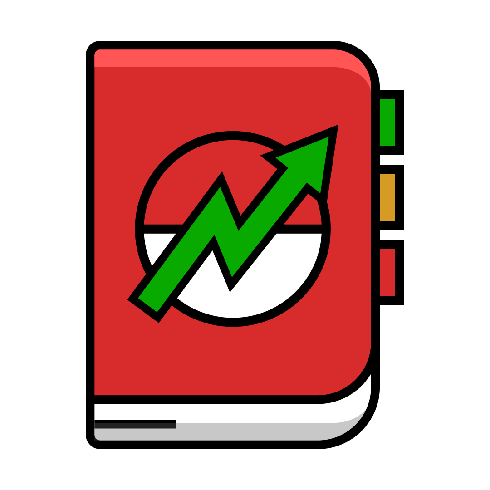

<p align="center">
  <a href="https://pokemmohub.com">
    
  </a>
</p>
<h1 align="center">
  <a href="https://pokemmohub.com">
  PokeMMO-Hub
</h1>

## 📃Contents

- [📃Contents](#contents)
- [✨ What are the main features of the website? ](#-what-are-the-main-features-of-the-website-)
- [⚙️ How can you contribute? ](#️-how-can-you-contribute-)
  - [Help us translate ](#help-us-translate-)
  - [Contribute via Github ](#contribute-via-github-)
    - [Setup your workspace ](#setup-your-workspace-)
  - [Issues/Suggestions ](#issuessuggestions-)
- [💙 Credits ](#-credits-)

## ✨ What are the main features of the website? <a id="tools"></a>

1. **Item Prices and Investments** <a id="tools-0"></a>

Know the current item prices, stay informed and in control of your investments. View detailed price and volume charts for any item, allowing you to analyze trends, identify potential opportunities, and make good decisions.

Save your investments to a dedicated watchlist for easy monitoring. Never lose track of an item's price again – get a clear picture of its history and stay ahead of the curve.

2. **Breeding Simulator** <a id="tools-1"></a>

Set how many IVs you want on a Pokémon and if you want to consider the nature on it too. The website will calculate how many Pokémon you need for that breeding and will split them in groups. 

You must give an IV to every group and you'll get a graph with every breed and the final result on it. 

3. **Pokedex** <a id="tools-2"></a>

A Pokédex but with PokeMMO in mind. The Pokémon list doesn't every piece of information out there, for that there are better sites like https://pokemondb.net. 

Filter the Pokémon by egg groups, routes, horde etc. You can also click on the buttons in the search bar to activate the hidden tab in the whole Pokédex.

1. **Egg Moves Calculator** <a id="tools-3"></a>

This feature is pretty easy to explain but come handy in a lot of situations. You just have to select the Pokémon you want information for, select the egg move you want to get and the tool will calculate all the required breedings. 

5. **Cosmetics Helper** <a id="tools-4"></a>

This feature is easy to explain too. Just a collection of every cosmetics available in the game. You can try them on the fly and see how different set matches together. You can also select the follower Pokémon and if you want it to be shiny or not. 
You do not have to buy all the cosmetics in game just to check how they match together now. 

1. **Quick info sections** <a id="tools-5"></a>

A section, available on the main page, which list all the quick info which a newbie could need. For example, a calculator of Rich charm, just to check how much you gain using it, and the level cap for every region.

## ⚙️ How can you contribute? <a id="contribute"></a>

### Help us translate <a id="contribute-0"></a>

We need your skills to translate and fix typos in our project. Every contribution, big or small, makes a huge difference. Help us add more and more languages so everyone can benefit from PokeMMO Hub.

The crowdin project can be found [here](https://crowdin.com/project/pokemmohub)

### Contribute via Github <a id="contribute-1"></a>

Do you have general knowledge of web development and want to add your own features or improve existing ones?

We are looking for passionate individuals who want to help us shape the future of this project.

#### Setup your workspace <a id="setup-your-workspace"></a>

To setup this project you will need [NodeJS](https://nodejs.org/en) (LTS), [Yarn](https://yarnpkg.com/), a git client and a text editor.

Run the following commands to clone this project and download all dependencies.
```sh
$ git clone https://github.com/PokeMMO-Tools/pokemmo-hub.git
$ cd pokemmo-hub/
$ yarn
```

Before you can run the website locally you need to create a `.env.development` and populate it with you firebase credentials for your test project. You can either create your own firebase project for debugging or try the firebase emulators.

`NOTE: Setting up the firebase is OPTIONAL. Populate fields with fake data if you do not wish to use login functionality.`
```
GATSBY_FIREBASE_API_KEY="..."
GATSBY_FIREBASE_AUTH_DOMAIN="..."
GATSBY_FIREBASE_PROJECT_ID="..."
GATSBY_FIREBASE_STORAGE_BUCKET="..."
GATSBY_FIREBASE_MESSAGING_SENDER_ID="..."
GATSBY_FIREBASE_APP_ID="..."
GATSBY_FIREBASE_MEASUREMENT_ID="..."
GATSBY_FIREBASE_FIRESTORE_DATABASE_ID="..."
```

Now you can start the website:
```sh
$ yarn start
```

### Issues/Suggestions <a id="issues-suggestions"></a>


If you come across any issues, bugs, or have suggestions for enhancements, follow these steps to submit them:

1. **Check Existing Issues:** Before submitting a new issue, please make sure to check the existing issues to see if your problem or suggestion has already been reported. You can search for keywords or browse through the open/closed issues.

2. **Create a New Issue:**
   - Click on the "Issues" tab at the top of this repository.
   - Click the green "New Issue" button.
   - Choose the appropriate issue template (Bug Report or Feature Suggestion).
   - Fill in the required information, including a clear and concise title, description, steps to reproduce (for bugs), and any relevant information.

3. **Labels and Milestones:**
   - We use labels to categorize and prioritize issues. Please select the appropriate labels when creating an issue.
   - Milestones may be used to group related issues together for a specific release or update.

Feel free to participate in discussions related to issues. You can add your input, provide additional information, or suggest possible solutions.

For general support or questions, you can join our Discord server: [https://discord.gg/FFGBkMHnQ3](https://discord.gg/FFGBkMHnQ3). 
Our community and team members will be happy to help you out.


## 💙 Credits <a id="credits"></a>
- Thanks to Yibu for a massive dataset with a lot of information on PokeMMO, fantastic for developing new tools.
- Thanks to boebi for developing the Multi Graph tool.
- Thanks to Bestfriends and Scales (Saclex) for tips on UI improvements.
- Everyone who reported bugs and helped us improve the website
- Everyone who helped in fixing bugs
